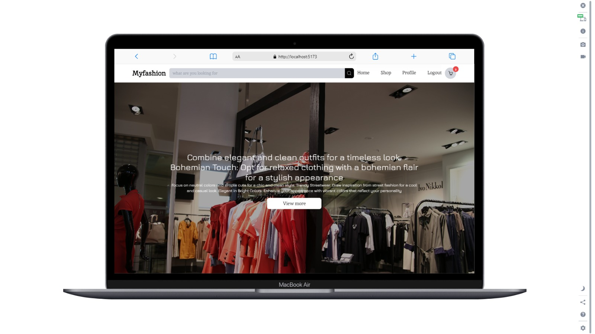

# MyFashion Backend

- [Frontend Link](https://github.com/Juaini742/market-place-fe)

## Overview



Welcome to the MyFashion Backend repository! This backend system serves as the core infrastructure for the MyFashion application, a platform designed to revolutionize the way users engage with fashion content, discover new trends, and connect with their favorite brands.

## Table of Contents

1. Introduction
2. Features
3. Getting Started
4. Dependencies
5. Setup
6. Usage
7. API Endpoints
8. Contributing
9. License

## Introduction

The MyFashion Backend is responsible for handling user authentication, managing fashion-related data, and powering the dynamic features of the MyFashion application. It is built with scalability, performance, and security in mind to ensure a seamless user experience.

## Features

- User Authentication: Secure user authentication and authorization mechanisms to protect user accounts and sensitive data.
- Fashion Data Management: Efficient storage and retrieval of fashion-related data, including user preferences, trends, and brand information.
- Search and Recommendation: Advanced search capabilities and recommendation algorithms to help users discover new fashion items and trends.
- API Integration: Seamless integration with third-party APIs to fetch and update real-time data related to fashion trends, pricing, and availability.

## Getting Started And Installation

To get started with the MyFashion Backend, follow these steps:

1. Clone the repository: git clone https://github.com/Juaini742/market-place-be
2. Install dependencies:

```sh
npm install
```

3. Configure environment variables (see Setup section).
4. Run database migrations and seeders:

```sh
npx sequelize-cli init
npx sequelize-cli db:create
npm run reset
```

5. Run the server:

```sh
npm start
```

## Dependencies

- axios
- bcryptjs
- body-parser
- cors
- dotenv
- express
- jsonwebtoken
- midtrans-client
- multer
- mysql2
- sequelize
- ts-node
- typescript

## Setup

Before running the application, make sure to set up the following environment variables:

- SERVER_PORT=
- MIDTRANS_PUBLIC_CLIENT =
- MIDTRANS_PUBLIC_SECRET =
- MIDTRANS_PUBLIC_API =
- CLOUDINARY_CLOUD_NAME=
- CLOUDINARY_API_KEY=
- CLOUDINARY_API_SECRET=

## Usage

Once the backend is up and running, the MyFashion frontend can interact with the API endpoints to provide users with a rich and engaging experience. Refer to the API Endpoints section for details on available routes.

## API Endpoints

- user
  - api/register: Create new user.
  - /api/login: Login for get new access token.
  - /api/logout: Logout and delete token.
  - /api/updateUser: Update User must have a token.
- Products
  - /api/public/products/: Get all products.
  - api/public/products?keyword=&page=1&sortBySold=false&sortByPrice=false&sortByLowestPrice=false&sortOrder=: Complite url for search etc.
  - /api/secured/addProduct: Add product as being seller.
  - /api/secured/update/:id: Update product by product id.
  - /api/secured/delete/:id: Delete product by product id.
- Carts
  - /api/secured/cartsUser/:id: Get all cart items by user id.
  - /api/secured/cart/:id: Post new cart item by product id.
  - /api/secured/deleteCart/:id: Delete cart item by cart id.
  - /api/secured/updateCart/:id: Update quantity product item in cart by cart id.
- Address
  - /api/secured/getAddressByUserId/:id: Get address data by user id
  - /api/secured/updateAddress/:id: Update address by address id
- Shipping
  - /api/secured/shipping/:id: Post/make shipping by address id
  - /api/secured/shipping/:id: Get shipping by user id
- Comments
  - /api/secured/getCommentProductId/:id: Get all comment by product id
  - /api/secured/getCommentUser/:id: Get all comment by user id
  - /api/secured/updateComment/:id: Get all comment by comment id
  - /api/secured/deleteComment/:id: Get all comment by comment id

If the router URL has "secured," it requires authentication to access. If it has "public," it means you can access that URL without authentication.

## Contributing

We welcome contributions from the community! If you find any issues or have suggestions for improvements, feel free to submit a pull request or open an issue.

## License

This project is licensed under the MIT License. Feel free to use, modify, and distribute the code as per the terms of the license.

## Demo
